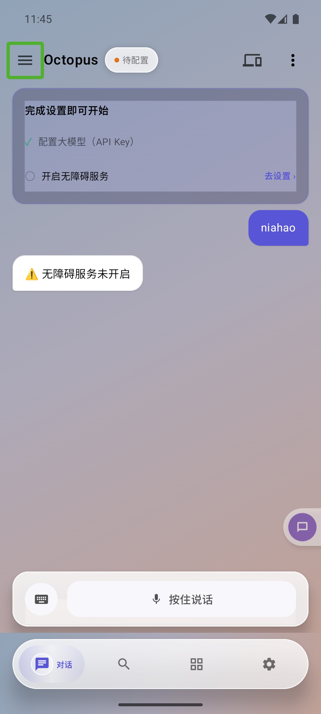
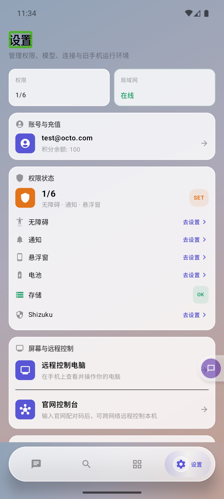

# Octopus Mobile

[简体中文](README_CN.md) · [Changelog](CHANGELOG.md)

An AI-powered Android automation app that lets an LLM agent operate an Android device (phone / TV box) through natural language. Users send instructions over a messaging channel (DingTalk, Feishu, QQ, Discord, Telegram, WeChat); the agent interprets the intent and autonomously drives the device.

## Screenshots

<p align="center">
  
  
</p>

## Architecture

```
Messaging channels (DingTalk / Feishu / QQ / Discord / Telegram / WeChat)
            │  inbound message
            ▼
      ChannelManager        message routing
            │
      TaskOrchestrator      priority task queue + preemption, Home reset
            │
      DefaultAgentService   the agent loop
        ├─ LLM call ........ LangChain4j (OpenAI / Anthropic)
        ├─ tool execution .. ToolRegistry → ClawAccessibilityService
        └─ loop until `finish` or max iterations (40)
            │
            ▼
      reply to the user over the same channel
```

## Core execution flow

1. The user sends a natural-language message over any connected channel.
2. `ChannelSetup` verifies the Accessibility service is enabled.
3. `TaskOrchestrator` schedules the task (priority queue, can preempt) and presses Home to reset device state.
4. `DefaultAgentService` runs the **observe → think → act → verify** loop:
   - Builds the system prompt, injecting device context (brand, model, resolution, registered tools), evolution lessons and cross-session memory.
   - Calls the LLM with tool definitions (via the LangChain4j bridge).
   - Extracts tool calls, executes them through `ToolRegistry` → `ClawAccessibilityService`.
   - Feeds results back; compresses history (e.g. keeps only the latest `get_screen_info`) to save tokens.
   - Detects dead loops (4-round fingerprint window) and system dialogs (`getRootInActiveWindow()` == null → VLM screenshot analysis).
   - Loops until the `finish` tool is called or it hits the iteration cap.
5. The result is returned over the same channel.

## Agent system

- **LLM backends** are pluggable via `LlmClientFactory`: OpenAI-compatible (`OpenAiLlmClient`) and Anthropic (`AnthropicLlmClient`), both streaming and non-streaming. The HTTP layer uses an OkHttp adapter instead of the JDK HttpClient for Android compatibility.
- **Retries**: up to 3 attempts with exponential backoff (1s → 2s → 4s); no retry on 401/403.
- **Self-evolution**: every tool result is scored (`TurnScorer`); periodically the agent reflects on recent turns and stores "lessons" (MMKV) that are injected into later prompts.
- **Config** (`AgentConfig`): `apiKey`, `baseUrl` (default `https://api.openai.com/v1`), `modelName`, `provider` (`OPENAI` default / `ANTHROPIC`), `temperature` (0.1), `maxIterations` (80), `streaming`.

## Tools

Tools extend `BaseTool` and are registered per device type in `ToolRegistry`. Highlights:

- **Screen / nav**: `get_screen_info`, `find_node_info`, `take_screenshot`, `input_text`, `open_app`, `get_installed_apps`, `press_back` / `press_home`, `open_recent_apps`, notifications, `lock_screen`, `wait`, `repeat_actions`, `send_file`, `finish`.
- **Phone gestures**: `tap`, `long_press`, `swipe`, `click_by_text`, `click_by_id`.
- **Browser** (System WebView / Chromium): `browser_navigate/click/type/get_dom/screenshot/evaluate/install_extension`.
- **Media**: scan local / WebDAV / cloud-drive media and play.

Every tool call passes through a **safety layer** in `ToolRegistry`: a `SafetyGate` (PII / secret scan) and a `ToolCallGuardrail` (repeated-failure / no-progress detection that can warn, block or halt).

## Channels

| Channel | Protocol | Credentials |
|---|---|---|
| DingTalk | App Stream Client | Client ID + Secret |
| Feishu | OAPI SDK | App ID + Secret |
| QQ | QQ Bot API | App ID + Secret |
| Discord | Gateway WebSocket + REST | Bot Token |
| Telegram | Bot HTTP API | Bot Token |
| WeChat | — | — |

Credentials can be set in-app or over a LAN HTTP server (`http://<device-ip>:9527`). On GET, secrets are masked to the last 4 characters; debug builds expose `/debug.html`.

## Accessibility service

`ClawAccessibilityService` (Java) is the device-interaction core: gestures via `dispatchGesture()`, UI tree via `getRootInActiveWindow()`, key actions via `performGlobalAction()`, and `takeScreenshot()` (Android 11+). Protected system windows block both tree reads and gesture injection; the agent detects this and screenshots the user.

## Build & run

Requirements: JDK 17, Android Studio (Ladybug+), Android SDK 36 (compile/target), min SDK 28.

```bash
git clone https://github.com/octopus-agent/octopus-mobile.git
cd octopus-mobile
./gradlew assembleDebug      # or assembleRelease
```

Then: install the APK (Android 9+) → grant permissions (Accessibility, notifications, overlay, battery whitelist, file access) → configure LLM (Settings > LLM Config) → configure at least one channel → send a message.

> The `src/` directory plus `package.json`/`vite.config.ts` are a small **React/Vite UI prototype** (a phone mockup) and are not part of the Android build.

## Implementation status

The core agent pipeline is mature; some peripheral capabilities are still in progress. This table reflects the real state of the code so docs and implementation stay in sync.

| Module | Status | Notes |
|---|---|---|
| Agent loop / context compression / loop detection | ✅ Complete | Core, stable |
| Safety guardrail + SafetyGate | ✅ Wired into ToolRegistry | Pre-check + result observation per call |
| Messaging channels (5+) | ✅ Complete | Priority task queue with preemption |
| Self-evolution L1 scoring / L2 reflection | ✅ Live | Lessons persisted to MMKV, injected into prompts |
| RPC remote-control layer (octopus_mobile) | ✅ Wired at startup | `ClawApplication` → `initOctopusMobile()` auto-connects to the Runtime |
| Accessibility service | ✅ Complete | Some reliability TODOs (node recycling, latch blocking) |
| Browser automation | ✅ Complete | System WebView (Chromium engine); `evaluateJavascript` / `get_dom` / `click` / `type` / `screenshot` all available |
| Shizuku shell escalation | ⚠️ Limited | `exec()` currently falls back to in-process `Runtime.exec()`; needs `IUserService` binding to run as shell. Gestures still work via `dispatchGesture` fallback |
| Screen cast / external-display workspace | ⚠️ Usable but incomplete | Detection/render/REST work; window tracking & some dock actions unimplemented |
| Self-evolution L3 deepEvolve / CanaryManager | 💤 Implemented, not wired | No call site yet |
| Plugin system (DexClassLoader) | 💤 Dormant | Manual trigger only; manifest is scanned, .dex is not |
| mpv media playback (MpvController) | 🔴 Stub | Playback methods are no-ops pending a port; media scanning works |

Legend: ✅ complete · ⚠️ partial/limited · 💤 implemented but not wired · 🔴 stub

## Key dependencies

LangChain4j 1.12.2 (agent/tools/LLM), OkHttp 4.12.0 / Retrofit 2.11.0, NanoHTTPD 2.3.1 (LAN config), MMKV 2.3.0, Gson 2.13.2, Shizuku 13.1.5, Jetpack Compose. See [README_CN.md](README_CN.md) for the full list.

## License

Licensed under the Apache License, Version 2.0. See [LICENSE](LICENSE).
